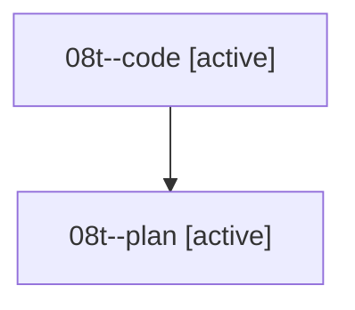

# Family: 08t

[Agent Hoods](../README.md) / [bbugyi200](../users/bbugyi200/README.md) / [athena](../users/bbugyi200/machines/athena/README.md) / [08t](../users/bbugyi200/machines/athena/hoods/08t/README.md) / 08t

Owner: `bbugyi200.athena` · Hood: `08t` · Members: 2

## Lineage

The diagram is an optional enhancement; the ordered table below contains the same lineage in accessible text.

| Role | Agent | State | Model / provider | Timing | Commits | Prompt | Chat |
|---|---|---|---|---|---:|---|---|
| code | 08t--code | active | gpt-5.5 / codex | 2026-08-20T17:50:24.139872+00:00 | [1](../agents/bbugyi200.athena.08t--code/README.md#commits) | — | — |
| plan | 08t--plan | active | gpt-5.6-sol / codex | 2026-08-20T17:43:29.888288+00:00 | 0 | [Prompt](../agents/bbugyi200.athena.08t--plan/prompt.md) | [Chat](../agents/bbugyi200.athena.08t--plan/chat.md) |

## Commits

| Role | Repo | Commit | Subject | Committed |
|---|---|---|---|---|
| — | sase | [`b091695`](https://github.com/sase-org/sase/commit/b091695f7bf9515ce096364a786e685b2e4e501d) | feat(memory): number inlined short memory headers | 2026-06-28 08:19:20 EDT |
| code | sase | [`a1da80d`](https://github.com/sase-org/sase/commit/a1da80ddb24bc1c550c08d4a19d1f96ad2259af9) | feat(memory)!: migrate artifact guidance to generated memory | 2026-08-20 14:26:20 EDT |
