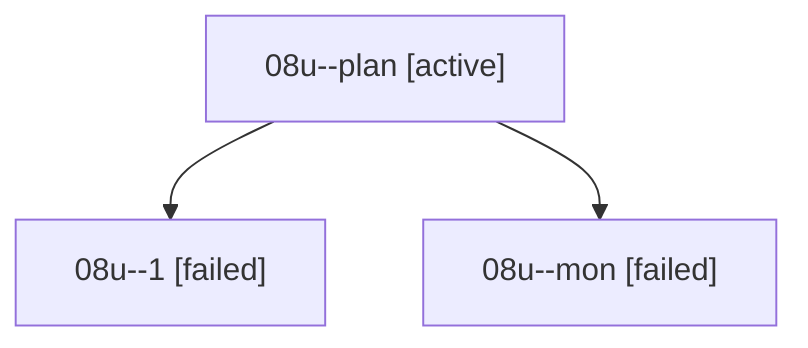

# Family: 08u

[Agent Hoods](../README.md) / [bbugyi200](../users/bbugyi200/README.md) / [athena](../users/bbugyi200/machines/athena/README.md) / [08u](../users/bbugyi200/machines/athena/hoods/08u/README.md) / 08u

Owner: `bbugyi200.athena` · Hood: `08u` · Members: 3

## Lineage

The diagram is an optional enhancement; the ordered table below contains the same lineage in accessible text.

| Role | Agent | State | Model / provider | Timing | Commits | Prompt | Chat |
|---|---|---|---|---|---:|---|---|
| plan | 08u--plan | active | gpt-5.6-sol / codex | 2026-08-20T18:09:38.297073+00:00 | 0 | [Prompt](../agents/bbugyi200.athena.08u--plan/prompt.md) | [Chat](../agents/bbugyi200.athena.08u--plan/chat.md) |
| 1 | 08u--1 | failed | gpt-5.6-sol / codex | 2026-08-20T18:32:38.917537+00:00 | 0 | — | [Chat](../agents/bbugyi200.athena.08u--1/chat.md) |
| mon | 08u--mon | failed | gpt-5.6-sol / codex | 2026-08-20T18:47:34.373911+00:00 | 0 | — | [Chat](../agents/bbugyi200.athena.08u--mon/chat.md) |

## Commits

| Role | Repo | Commit | Subject | Committed |
|---|---|---|---|---|
| — | sase | [`5b488ee`](https://github.com/sase-org/sase/commit/5b488eecbd0a2b5683ed6f8c495243d6b602f461) | chore: Add SDD prompt and plan for memory\_init\_fold\_commit | 2026-06-28 08:38:44 EDT |
