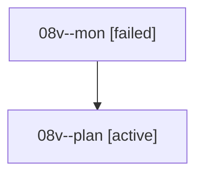

# Family: 08v

[Agent Hoods](../README.md) / [bbugyi200](../users/bbugyi200/README.md) / [athena](../users/bbugyi200/machines/athena/README.md) / [08v](../users/bbugyi200/machines/athena/hoods/08v/README.md) / 08v

Owner: `bbugyi200.athena` · Hood: `08v` · Members: 2

## Lineage

The diagram is an optional enhancement; the ordered table below contains the same lineage in accessible text.

| Role | Agent | State | Model / provider | Timing | Commits | Prompt | Chat |
|---|---|---|---|---|---:|---|---|
| mon | 08v--mon | failed | gpt-5.6-sol / codex | 2026-08-20T18:37:43.247106+00:00 | 0 | — | [Chat](../agents/bbugyi200.athena.08v--mon/chat.md) |
| plan | 08v--plan | active | gpt-5.6-sol / codex | 2026-08-20T18:25:35.966807+00:00 | 0 | [Prompt](../agents/bbugyi200.athena.08v--plan/prompt.md) | [Chat](../agents/bbugyi200.athena.08v--plan/chat.md) |

## Commits

| Role | Repo | Commit | Subject | Committed |
|---|---|---|---|---|
| — | sase | [`04595d3`](https://github.com/sase-org/sase/commit/04595d3159d7451bca8a1eef28b24ee6c7d6f200) | feat(memory): fold dirty memory edits into init commits | 2026-06-28 09:10:40 EDT |
