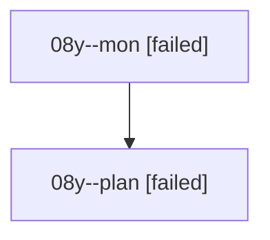

# Family: 08y

[Agent Hoods](../README.md) / [bbugyi200](../users/bbugyi200/README.md) / [athena](../users/bbugyi200/machines/athena/README.md) / [08y](../users/bbugyi200/machines/athena/hoods/08y/README.md) / 08y

Owner: `bbugyi200.athena` · Hood: `08y` · Members: 2

## Lineage

The diagram is an optional enhancement; the ordered table below contains the same lineage in accessible text.

| Role | Agent | State | Model / provider | Timing | Commits | Prompt | Chat |
|---|---|---|---|---|---:|---|---|
| mon | 08y--mon | failed | gpt-5.6-sol / codex | 2026-08-20T20:34:46.955878+00:00 | 0 | — | [Chat](../agents/bbugyi200.athena.08y--mon/chat.md) |
| plan | 08y--plan | failed | gpt-5.6-sol / codex | 2026-08-20T20:20:17.071059+00:00 | 0 | [Prompt](../agents/bbugyi200.athena.08y--plan/prompt.md) | [Chat](../agents/bbugyi200.athena.08y--plan/chat.md) |
