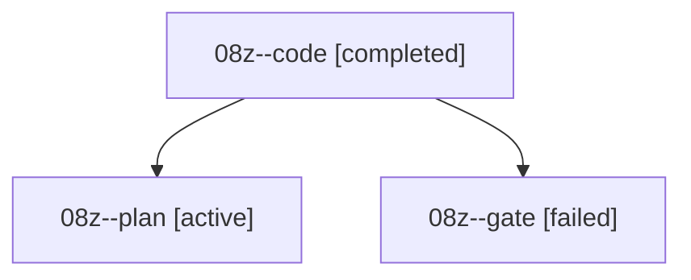

# Family: 08z

[Agent Hoods](../README.md) / [bbugyi200](../users/bbugyi200/README.md) / [athena](../users/bbugyi200/machines/athena/README.md) / [08z](../users/bbugyi200/machines/athena/hoods/08z/README.md) / 08z

Owner: `bbugyi200.athena` · Hood: `08z` · Members: 3

## Lineage

The diagram is an optional enhancement; the ordered table below contains the same lineage in accessible text.

| Role | Agent | State | Model / provider | Timing | Commits | Prompt | Chat |
|---|---|---|---|---|---:|---|---|
| code | 08z--code | completed | gpt-5.5 / codex | 2026-09-08T16:35:36.406051+00:00 → 2026-09-08T18:01:10.592959+00:00 | [1](../agents/bbugyi200.athena.08z--code/README.md#commits) | [Prompt](../agents/bbugyi200.athena.08z--code/prompt.md) | [Chat](../agents/bbugyi200.athena.08z--code/chat.md) |
| plan | 08z--plan | active | gpt-6-astra / codex | 2026-09-08T16:21:01.928487+00:00 | 0 | [Prompt](../agents/bbugyi200.athena.08z--plan/prompt.md) | [Chat](../agents/bbugyi200.athena.08z--plan/chat.md) |
| gate | 08z--gate | failed | gpt-6-astra / codex | 2026-09-08T16:31:21.202986+00:00 → 2026-09-08T16:35:14.884140+00:00 | 0 | — | [Chat](../agents/bbugyi200.athena.08z--gate/chat.md) |

## Commits

| Role | Repo | Commit | Subject | Committed |
|---|---|---|---|---|
| — | sase | [`2e7e186`](https://github.com/sase-org/sase/commit/2e7e1862da6aefe5af8c93613c40940d03a5edab) | chore: Add SDD prompt and plan for feedback\_agent\_status | 2026-06-28 10:13:59 EDT |
| — | sase | [`d03d22f`](https://github.com/sase-org/sase/commit/d03d22fd26118c8e74a0b907ff94d819f16a8c9d) | fix: mark superseded planner rounds as feedback | 2026-06-28 10:28:22 EDT |
| code | sase | [`952ef34`](https://github.com/sase-org/sase/commit/952ef34f5a8b5fbb58389f42c8df0e38d86882a0) | test(pager): expect live bead missing-store diagnostic | 2026-09-08 13:58:29 EDT |

## Neighbors

| Agent | Relation | State |
|---|---|---|
| [08z.f0](../agents/bbugyi200.athena.08z.f0/README.md) | descendant | waiting |
