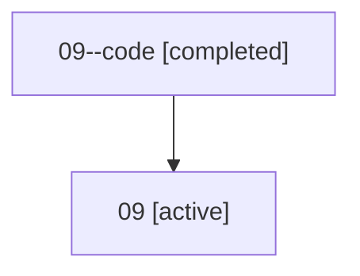

# Family: 09

[Agent Hoods](../README.md) / [bbugyi200](../users/bbugyi200/README.md) / [athena](../users/bbugyi200/machines/athena/README.md) / [09](../users/bbugyi200/machines/athena/hoods/09/README.md) / 09

Owner: `bbugyi200.athena` · Hood: `09` · Members: 2

## Lineage

The diagram is an optional enhancement; the ordered table below contains the same lineage in accessible text.

| Role | Agent | State | Model / provider | Timing | Commits | Prompt | Chat |
|---|---|---|---|---|---:|---|---|
| code | 09--code | completed | gpt-5.5 / codex | 2026-07-07T04:32:06.528291+00:00 | [1](../agents/bbugyi200.athena.09--code/README.md#commits) | — | [Chat](../agents/bbugyi200.athena.09--code/chat.md) |
| root | 09 | active | claude-fable-5 / claude | 2026-07-07T04:19:58.216329+00:00 | [1](../agents/bbugyi200.athena.09/README.md#commits) | [Prompt](../agents/bbugyi200.athena.09/prompt.md) | [Chat](../agents/bbugyi200.athena.09/chat.md) |

## Commits

| Role | Repo | Commit | Subject | Committed |
|---|---|---|---|---|
| — | sase | [`ca8d0c5`](https://github.com/sase-org/sase/commit/ca8d0c5bde01a10b665436c98aa8384b87eacc11) | chore: Add SDD prompt and plan for project\_management\_inactive\_vcs\_launch | 2026-06-02 18:25:42 EDT |
| — | sase | [`2559e8a`](https://github.com/sase-org/sase/commit/2559e8a3e60738007375ef68f26525913ab36f22) | feat: reactivate inactive project refs on launch | 2026-06-02 18:52:30 EDT |
| — | sase | [`1c21d26`](https://github.com/sase-org/sase/commit/1c21d266a286f0b52f505556813970862bb16788) | feat(tui): add vim + readline editing to config edit inputs | 2026-07-05 19:12:53 EDT |
| root | sase | [`02c54c6`](https://github.com/sase-org/sase/commit/02c54c6392702035d1c28098565cc7a61d299a10) | chore: Add SDD prompt and plan for kill\_waiting\_agents\_pid\_fallback | 2026-07-07 00:32:05 EDT |
| code | sase | [`2601f87`](https://github.com/sase-org/sase/commit/2601f87b3e4660b1d285bd302010e227fd159397) | fix(agent): clean up stale waiting agents on kill | 2026-07-07 00:49:53 EDT |
