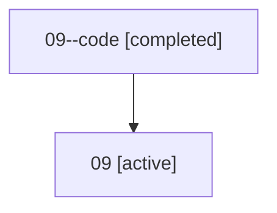

# Family: 09

Owner: `bbugyi200.athena` · Hood: `09` · Members: 2

## Lineage

The diagram is an optional enhancement; the ordered table below contains the same lineage in accessible text.

| Role | Agent | State | Model / provider | Timing | Commits | Prompt | Chat |
|---|---|---|---|---|---:|---|---|
| code | 09--code | completed | gpt-5.5 / codex | 2026-07-07T04:32:06.528291+00:00 | 1 | — | [Chat](../agents/bbugyi200.athena.09--code/chat.md) |
| root | 09 | active | claude-fable-5 / claude | 2026-07-07T04:19:58.216329+00:00 | 5 | [Prompt](../agents/bbugyi200.athena.09/prompt.md) | [Chat](../agents/bbugyi200.athena.09/chat.md) |
