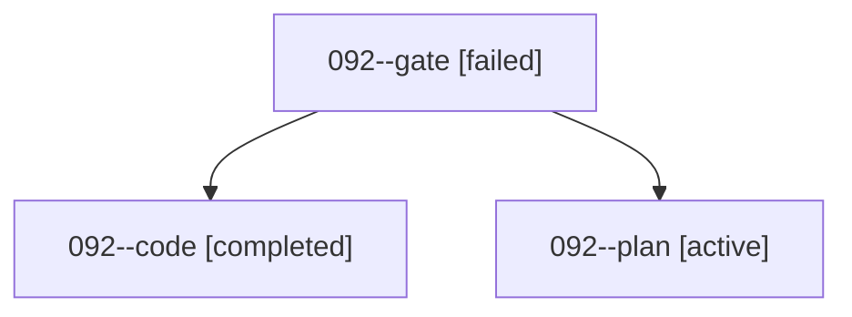

# Family: 092

[Agent Hoods](../README.md) / [bbugyi200](../users/bbugyi200/README.md) / [athena](../users/bbugyi200/machines/athena/README.md) / [092](../users/bbugyi200/machines/athena/hoods/092/README.md) / 092

Owner: `bbugyi200.athena` · Hood: `092` · Members: 3

## Lineage

The diagram is an optional enhancement; the ordered table below contains the same lineage in accessible text.

| Role | Agent | State | Model / provider | Timing | Commits | Prompt | Chat |
|---|---|---|---|---|---:|---|---|
| gate | 092--gate | failed | gpt-5.6-sol / codex | 2026-09-08T19:29:13.288162+00:00 → 2026-09-08T19:32:34.983211+00:00 | 0 | — | [Chat](../agents/bbugyi200.athena.092--gate/chat.md) |
| code | 092--code | completed | gpt-5.5 / codex | 2026-09-08T19:32:43.948695+00:00 → 2026-09-08T20:30:12.951947+00:00 | [1](../agents/bbugyi200.athena.092--code/README.md#commits) | [Prompt](../agents/bbugyi200.athena.092--code/prompt.md) | [Chat](../agents/bbugyi200.athena.092--code/chat.md) |
| plan | 092--plan | active | gpt-5.6-sol / codex | 2026-09-08T17:55:19.315431+00:00 | 0 | [Prompt](../agents/bbugyi200.athena.092--plan/prompt.md) | [Chat](../agents/bbugyi200.athena.092--plan/chat.md) |

## Commits

| Role | Repo | Commit | Subject | Committed |
|---|---|---|---|---|
| — | sase | [`ae869eb`](https://github.com/sase-org/sase/commit/ae869eb5ddf31ffc4476dcbb56c8c83ed3447969) | fix(ace): lift frontmatter on prompt history loads | 2026-06-28 13:13:59 EDT |
| code | sase | [`3fd2b5e`](https://github.com/sase-org/sase/commit/3fd2b5e2ff70e3062809a4a42f7c2482c5bf5c70) | feat(ace): add update everything leader shortcut | 2026-09-08 16:27:08 EDT |
