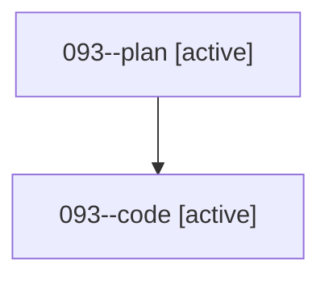

# Family: 093

[Agent Hoods](../README.md) / [bbugyi200](../users/bbugyi200/README.md) / [athena](../users/bbugyi200/machines/athena/README.md) / [093](../users/bbugyi200/machines/athena/hoods/093/README.md) / 093

Owner: `bbugyi200.athena` · Hood: `093` · Members: 2

## Lineage

The diagram is an optional enhancement; the ordered table below contains the same lineage in accessible text.

| Role | Agent | State | Model / provider | Timing | Commits | Prompt | Chat |
|---|---|---|---|---|---:|---|---|
| plan | 093--plan | active | gpt-5.6-sol / codex | 2026-08-21T12:17:30.888762+00:00 | 0 | [Prompt](../agents/bbugyi200.athena.093--plan/prompt.md) | [Chat](../agents/bbugyi200.athena.093--plan/chat.md) |
| code | 093--code | active | gpt-5.5 / codex | 2026-08-21T12:28:40.933958+00:00 | [1](../agents/bbugyi200.athena.093--code/README.md#commits) | — | — |

## Commits

| Role | Repo | Commit | Subject | Committed |
|---|---|---|---|---|
| code | sase | [`5152e09`](https://github.com/sase-org/sase/commit/5152e097e2b2b40f49ba45282c02c37f33bf87c5) | fix(stats): correct runner occupancy monitor peaks | 2026-08-21 08:50:55 EDT |
