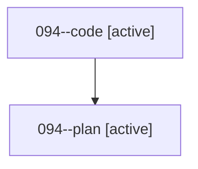

# Family: 094

[Agent Hoods](../README.md) / [bbugyi200](../users/bbugyi200/README.md) / [athena](../users/bbugyi200/machines/athena/README.md) / [094](../users/bbugyi200/machines/athena/hoods/094/README.md) / 094

Owner: `bbugyi200.athena` · Hood: `094` · Members: 2

## Lineage

The diagram is an optional enhancement; the ordered table below contains the same lineage in accessible text.

| Role | Agent | State | Model / provider | Timing | Commits | Prompt | Chat |
|---|---|---|---|---|---:|---|---|
| code | 094--code | active | gpt-5.5 / codex | 2026-08-21T12:41:23.146954+00:00 | [1](../agents/bbugyi200.athena.094--code/README.md#commits) | — | — |
| plan | 094--plan | active | gpt-5.6-sol / codex | 2026-08-21T12:35:47.305693+00:00 | 0 | [Prompt](../agents/bbugyi200.athena.094--plan/prompt.md) | [Chat](../agents/bbugyi200.athena.094--plan/chat.md) |

## Commits

| Role | Repo | Commit | Subject | Committed |
|---|---|---|---|---|
| — | sase | [`925c723`](https://github.com/sase-org/sase/commit/925c723a8729ef33c478186e2582520f99ce0eb7) | chore: Add SDD prompt and plan for agy\_model\_alias\_routing | 2026-06-28 16:52:26 UTC |
| — | sase | [`a708cd4`](https://github.com/sase-org/sase/commit/a708cd44b81bb8dadfebea0bda2eceb0894af90a) | feat(doctor): guard model xprompt presets against provider fallback | 2026-06-28 17:14:51 UTC |
| code | sase | [`e91b9f8`](https://github.com/sase-org/sase/commit/e91b9f83acba631f36d0d74b3e8a6e19ae63d51e) | fix(ace): route ctrl-g ctrl-x to mini xprompt | 2026-08-21 12:55:53 UTC |
