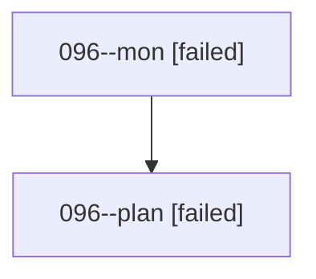

# Family: 096

[Agent Hoods](../README.md) / [bbugyi200](../users/bbugyi200/README.md) / [athena](../users/bbugyi200/machines/athena/README.md) / [096](../users/bbugyi200/machines/athena/hoods/096/README.md) / 096

Owner: `bbugyi200.athena` · Hood: `096` · Members: 2

## Lineage

The diagram is an optional enhancement; the ordered table below contains the same lineage in accessible text.

| Role | Agent | State | Model / provider | Timing | Commits | Prompt | Chat |
|---|---|---|---|---|---:|---|---|
| mon | 096--mon | failed | gpt-5.6-sol / codex | 2026-08-21T13:05:37.010916+00:00 | 0 | — | [Chat](../agents/bbugyi200.athena.096--mon/chat.md) |
| plan | 096--plan | failed | gpt-5.6-sol / codex | 2026-08-21T12:40:32.274463+00:00 | 0 | [Prompt](../agents/bbugyi200.athena.096--plan/prompt.md) | [Chat](../agents/bbugyi200.athena.096--plan/chat.md) |

## Commits

| Role | Repo | Commit | Subject | Committed |
|---|---|---|---|---|
| — | sase | [`3121237`](https://github.com/sase-org/sase/commit/31212377883aa877409ed6612e19b06f8f4f9f6f) | chore: Add SDD prompt and plan for tasks\_tab\_live\_output | 2026-06-28 18:46:11 UTC |
| — | sase | [`2b2cd38`](https://github.com/sase-org/sase/commit/2b2cd389eb916149de61fb102ea9365a3bd11da6) | feat(tui): stream live task output in tasks tab | 2026-06-28 19:13:04 UTC |
