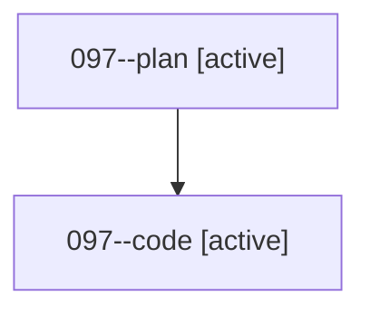

# Family: 097

[Agent Hoods](../README.md) / [bbugyi200](../users/bbugyi200/README.md) / [athena](../users/bbugyi200/machines/athena/README.md) / [097](../users/bbugyi200/machines/athena/hoods/097/README.md) / 097

Owner: `bbugyi200.athena` · Hood: `097` · Members: 2

## Lineage

The diagram is an optional enhancement; the ordered table below contains the same lineage in accessible text.

| Role | Agent | State | Model / provider | Timing | Commits | Prompt | Chat |
|---|---|---|---|---|---:|---|---|
| plan | 097--plan | active | gpt-5.6-sol / codex | 2026-08-21T12:41:08.808039+00:00 | 0 | [Prompt](../agents/bbugyi200.athena.097--plan/prompt.md) | [Chat](../agents/bbugyi200.athena.097--plan/chat.md) |
| code | 097--code | active | gpt-5.5 / codex | 2026-08-21T12:49:11.734114+00:00 | [1](../agents/bbugyi200.athena.097--code/README.md#commits) | — | — |

## Commits

| Role | Repo | Commit | Subject | Committed |
|---|---|---|---|---|
| — | sase | [`8036732`](https://github.com/sase-org/sase/commit/8036732eb6b39fbce66a4ffd2c5098cad1f663f0) | chore: Add SDD prompt and plan for completion\_escape\_normal\_mode | 2026-06-28 18:46:25 UTC |
| — | sase | [`58f1230`](https://github.com/sase-org/sase/commit/58f12304f8c7908723ad39029ab12a26d2a7e262) | fix(ace): enter normal mode when escaping prompt completion | 2026-06-28 18:51:56 UTC |
| code | sase | [`4ebdd05`](https://github.com/sase-org/sase/commit/4ebdd05ad019479ec2684c4f8f879088c73f525b) | feat(ace): highlight artifact refs in agent xprompts | 2026-08-21 13:20:23 UTC |
