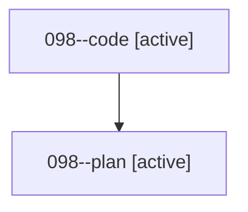

# Family: 098

[Agent Hoods](../README.md) / [bbugyi200](../users/bbugyi200/README.md) / [athena](../users/bbugyi200/machines/athena/README.md) / [098](../users/bbugyi200/machines/athena/hoods/098/README.md) / 098

Owner: `bbugyi200.athena` · Hood: `098` · Members: 2

## Lineage

The diagram is an optional enhancement; the ordered table below contains the same lineage in accessible text.

| Role | Agent | State | Model / provider | Timing | Commits | Prompt | Chat |
|---|---|---|---|---|---:|---|---|
| code | 098--code | active | gpt-5.5 / codex | 2026-08-21T13:11:41.816422+00:00 | 0 | — | — |
| plan | 098--plan | active | gpt-5.6-sol / codex | 2026-08-21T13:03:47.188595+00:00 | 0 | [Prompt](../agents/bbugyi200.athena.098--plan/prompt.md) | [Chat](../agents/bbugyi200.athena.098--plan/chat.md) |

## Commits

| Role | Repo | Commit | Subject | Committed |
|---|---|---|---|---|
| — | sase | [`dfe7d43`](https://github.com/sase-org/sase/commit/dfe7d439bb5de926a65315f9e94ebcd0a537f50c) | chore: Add SDD prompt and plan for update\_check\_startup\_toast | 2026-06-28 18:55:08 UTC |
| — | sase | [`d22ef80`](https://github.com/sase-org/sase/commit/d22ef802056d18a98806f81b7be598bc101535f7) | feat(ace): show startup toast for available updates | 2026-06-28 19:19:16 UTC |

## Neighbors

| Agent | Relation | State |
|---|---|---|
| [098.f1](../agents/bbugyi200.athena.098.f1/README.md) | descendant | completed |
