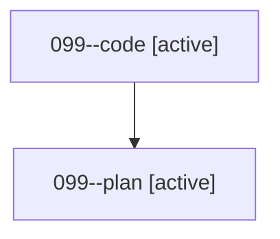

# Family: 099

[Agent Hoods](../README.md) / [bbugyi200](../users/bbugyi200/README.md) / [athena](../users/bbugyi200/machines/athena/README.md) / [099](../users/bbugyi200/machines/athena/hoods/099/README.md) / 099

Owner: `bbugyi200.athena` · Hood: `099` · Members: 2

## Lineage

The diagram is an optional enhancement; the ordered table below contains the same lineage in accessible text.

| Role | Agent | State | Model / provider | Timing | Commits | Prompt | Chat |
|---|---|---|---|---|---:|---|---|
| code | 099--code | active | gpt-5.5 / codex | 2026-08-21T13:18:32.596867+00:00 | [1](../agents/bbugyi200.athena.099--code/README.md#commits) | — | — |
| plan | 099--plan | active | gpt-5.6-sol / codex | 2026-08-21T13:06:35.486273+00:00 | 0 | [Prompt](../agents/bbugyi200.athena.099--plan/prompt.md) | [Chat](../agents/bbugyi200.athena.099--plan/chat.md) |

## Commits

| Role | Repo | Commit | Subject | Committed |
|---|---|---|---|---|
| — | sase | [`884efc5`](https://github.com/sase-org/sase/commit/884efc51082fd904517f3ffe64063d79c91b385e) | chore: Add SDD prompt and plan for tui\_xprompt\_snippet\_auto\_reload | 2026-06-28 15:38:57 EDT |
| — | sase | [`1a51990`](https://github.com/sase-org/sase/commit/1a51990c80bd18998a26bf2bf3cc47a5a786887b) | feat(tui): auto-reload xprompt completion catalog | 2026-06-28 16:23:17 EDT |
| code | sase | [`b6662f3`](https://github.com/sase-org/sase/commit/b6662f34d7022065a5895d119a7fd2e52a3f89fc) | feat(artifact-links): retire beta flag | 2026-08-21 10:16:21 EDT |
