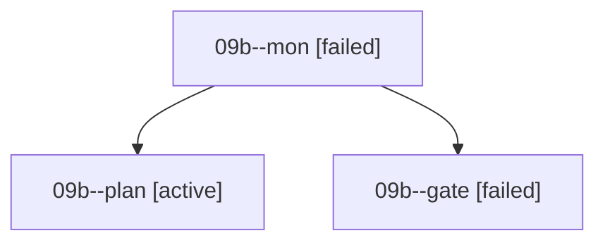

# Family: 09b

[Agent Hoods](../README.md) / [bbugyi200](../users/bbugyi200/README.md) / [athena](../users/bbugyi200/machines/athena/README.md) / [09b](../users/bbugyi200/machines/athena/hoods/09b/README.md) / 09b

Owner: `bbugyi200.athena` · Hood: `09b` · Members: 3

## Lineage

The diagram is an optional enhancement; the ordered table below contains the same lineage in accessible text.

| Role | Agent | State | Model / provider | Timing | Commits | Prompt | Chat |
|---|---|---|---|---|---:|---|---|
| mon | 09b--mon | failed | gpt-6-astra / codex | 2026-09-08T21:56:01.921030+00:00 → 2026-09-08T21:58:49.840246+00:00 | 0 | — | [Chat](../agents/bbugyi200.athena.09b--mon/chat.md) |
| plan | 09b--plan | active | gpt-6-astra / codex | 2026-09-08T21:23:17.101223+00:00 | 0 | [Prompt](../agents/bbugyi200.athena.09b--plan/prompt.md) | [Chat](../agents/bbugyi200.athena.09b--plan/chat.md) |
| gate | 09b--gate | failed | gpt-6-astra / codex | 2026-09-08T21:34:45.697980+00:00 → 2026-09-08T21:56:05.130984+00:00 | 0 | — | [Chat](../agents/bbugyi200.athena.09b--gate/chat.md) |

## Commits

| Role | Repo | Commit | Subject | Committed |
|---|---|---|---|---|
| — | sase | [`820967b`](https://github.com/sase-org/sase/commit/820967b22b2da6dd84acb5d7ddfb1a25f7ca7864) | chore: Add SDD prompt and plan for agent\_neighbors\_hoods | 2026-06-28 15:42:04 EDT |
| — | sase | [`d121dcd`](https://github.com/sase-org/sase/commit/d121dcd06c0ef5191b1d0e4c83e89f2c5db685c4) | feat(ace): replace agent siblings with hood-based neighbors | 2026-06-28 16:15:05 EDT |

## Neighbors

| Agent | Relation | State |
|---|---|---|
| [09b.f2](../agents/bbugyi200.athena.09b.f2/README.md) | descendant | completed |
| [09b.w0](../agents/bbugyi200.athena.09b.w0/README.md) | descendant | waiting |
