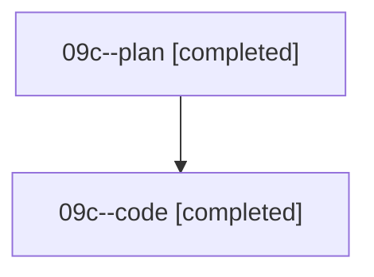

# Family: 09c

[Agent Hoods](../README.md) / [bbugyi200](../users/bbugyi200/README.md) / [athena](../users/bbugyi200/machines/athena/README.md) / [09c](../users/bbugyi200/machines/athena/hoods/09c/README.md) / 09c

Owner: `bbugyi200.athena` · Hood: `09c` · Members: 2

## Lineage

The diagram is an optional enhancement; the ordered table below contains the same lineage in accessible text.

| Role | Agent | State | Model / provider | Timing | Commits | Prompt | Chat |
|---|---|---|---|---|---:|---|---|
| plan | 09c--plan | completed | gpt-5.6-sol / codex | 2026-08-21T13:23:31.101824+00:00 | 0 | [Prompt](../agents/bbugyi200.athena.09c--plan/prompt.md) | [Chat](../agents/bbugyi200.athena.09c--plan/chat.md) |
| code | 09c--code | completed | grok-4.6 / grok | 2026-08-21T13:29:44.985290+00:00 | 0 | — | [Chat](../agents/bbugyi200.athena.09c--code/chat.md) |

## Commits

| Role | Repo | Commit | Subject | Committed |
|---|---|---|---|---|
| — | sase | [`999e727`](https://github.com/sase-org/sase/commit/999e7274780ae0e38a2a56a369f343b8b76ada98) | chore: Add SDD prompt and plan for updates\_tab\_incoming\_commits | 2026-06-28 16:38:44 EDT |
| — | sase | [`d6117f3`](https://github.com/sase-org/sase/commit/d6117f3d33e890001fd4f4b27514c65fd13941c1) | feat(updates): show incoming commits for available updates | 2026-06-28 17:08:48 EDT |
