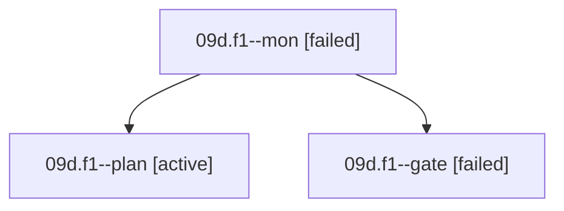

# Family: 09d.f1

[Agent Hoods](../README.md) / [bbugyi200](../users/bbugyi200/README.md) / [athena](../users/bbugyi200/machines/athena/README.md) / [09d](../users/bbugyi200/machines/athena/hoods/09d/README.md) / 09d.f1

Owner: `bbugyi200.athena` · Hood: `09d` · Members: 3

## Lineage

The diagram is an optional enhancement; the ordered table below contains the same lineage in accessible text.

| Role | Agent | State | Model / provider | Timing | Commits | Prompt | Chat |
|---|---|---|---|---|---:|---|---|
| mon | 09d.f1--mon | failed | claude-fable-5 / claude | 2026-09-09T15:48:03.740493+00:00 → 2026-09-09T15:50:46.023461+00:00 | 0 | — | [Chat](../agents/bbugyi200.athena.09d.f1--mon/chat.md) |
| plan | 09d.f1--plan | active | claude-fable-5 / claude | 2026-09-09T15:19:02.931733+00:00 | 0 | [Prompt](../agents/bbugyi200.athena.09d.f1--plan/prompt.md) | [Chat](../agents/bbugyi200.athena.09d.f1--plan/chat.md) |
| gate | 09d.f1--gate | failed | claude-fable-5 / claude | 2026-09-09T15:29:01.159991+00:00 → 2026-09-09T15:48:07.351623+00:00 | 0 | — | [Chat](../agents/bbugyi200.athena.09d.f1--gate/chat.md) |

## Neighbors

| Agent | Relation | State |
|---|---|---|
| [09d](../agents/bbugyi200.athena.09d/README.md) | ancestor | active |
