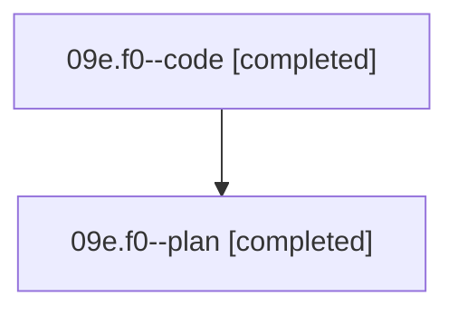

# Family: 09e.f0

[Agent Hoods](../README.md) / [bbugyi200](../users/bbugyi200/README.md) / [athena](../users/bbugyi200/machines/athena/README.md) / [09e](../users/bbugyi200/machines/athena/hoods/09e/README.md) / 09e.f0

Owner: `bbugyi200.athena` · Hood: `09e` · Members: 2

## Lineage

The diagram is an optional enhancement; the ordered table below contains the same lineage in accessible text.

| Role | Agent | State | Model / provider | Timing | Commits | Prompt | Chat |
|---|---|---|---|---|---:|---|---|
| code | 09e.f0--code | completed | grok-4.6 / grok | 2026-08-21T15:09:02.229189+00:00 | 0 | — | [Chat](../agents/bbugyi200.athena.09e.f0--code/chat.md) |
| plan | 09e.f0--plan | completed | gpt-5.6-sol / codex | 2026-08-21T15:04:23.633014+00:00 | 0 | [Prompt](../agents/bbugyi200.athena.09e.f0--plan/prompt.md) | [Chat](../agents/bbugyi200.athena.09e.f0--plan/chat.md) |

## Neighbors

| Agent | Relation | State |
|---|---|---|
| [09e](bbugyi200.athena.09e.md) (family · 2) | ancestor | completed 1, dismissed 1 |
