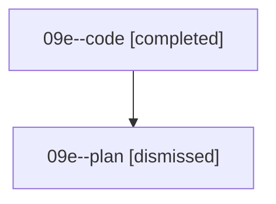

# Family: 09e

[Agent Hoods](../README.md) / [bbugyi200](../users/bbugyi200/README.md) / [athena](../users/bbugyi200/machines/athena/README.md) / [09e](../users/bbugyi200/machines/athena/hoods/09e/README.md) / 09e

Owner: `bbugyi200.athena` · Hood: `09e` · Members: 2

## Lineage

The diagram is an optional enhancement; the ordered table below contains the same lineage in accessible text.

| Role | Agent | State | Model / provider | Timing | Commits | Prompt | Chat |
|---|---|---|---|---|---:|---|---|
| code | 09e--code | completed | grok-4.6 / grok | 2026-08-21T13:36:11.269385+00:00 | 0 | — | [Chat](../agents/bbugyi200.athena.09e--code/chat.md) |
| plan | 09e--plan | dismissed | — | 2026-08-21T09:29:01 | 0 | — | — |

## Neighbors

| Agent | Relation | State |
|---|---|---|
| [09e.f0](bbugyi200.athena.09e.f0.md) (family · 2) | descendant | completed 2 |
