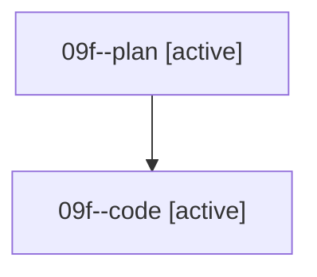

# Family: 09f

[Agent Hoods](../README.md) / [bbugyi200](../users/bbugyi200/README.md) / [athena](../users/bbugyi200/machines/athena/README.md) / [09f](../users/bbugyi200/machines/athena/hoods/09f/README.md) / 09f

Owner: `bbugyi200.athena` · Hood: `09f` · Members: 2

## Lineage

The diagram is an optional enhancement; the ordered table below contains the same lineage in accessible text.

| Role | Agent | State | Model / provider | Timing | Commits | Prompt | Chat |
|---|---|---|---|---|---:|---|---|
| plan | 09f--plan | active | gpt-5.6-sol / codex | 2026-08-21T13:35:56.735995+00:00 | 0 | [Prompt](../agents/bbugyi200.athena.09f--plan/prompt.md) | [Chat](../agents/bbugyi200.athena.09f--plan/chat.md) |
| code | 09f--code | active | grok-4.6 / grok | 2026-08-21T13:42:14.916930+00:00 | [1](../agents/bbugyi200.athena.09f--code/README.md#commits) | — | — |

## Commits

| Role | Repo | Commit | Subject | Committed |
|---|---|---|---|---|
| code | sase | [`88bd661`](https://github.com/sase-org/sase/commit/88bd66184e456d494e9ed8e6e7ed632ad37c85d6) | feat(tui): render soft-disabled alias members as amber glyphs | 2026-08-21 14:10:38 UTC |
