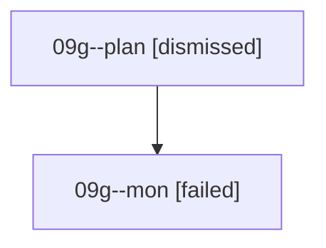

# Family: 09g

[Agent Hoods](../README.md) / [bbugyi200](../users/bbugyi200/README.md) / [athena](../users/bbugyi200/machines/athena/README.md) / [09g](../users/bbugyi200/machines/athena/hoods/09g/README.md) / 09g

Owner: `bbugyi200.athena` · Hood: `09g` · Members: 2

## Lineage

The diagram is an optional enhancement; the ordered table below contains the same lineage in accessible text.

| Role | Agent | State | Model / provider | Timing | Commits | Prompt | Chat |
|---|---|---|---|---|---:|---|---|
| plan | 09g--plan | dismissed | — | 2026-08-21T09:46:33 | 0 | — | — |
| mon | 09g--mon | failed | gpt-5.6-sol / codex | 2026-08-21T13:58:36.644092+00:00 | 0 | — | [Chat](../agents/bbugyi200.athena.09g--mon/chat.md) |

## Commits

| Role | Repo | Commit | Subject | Committed |
|---|---|---|---|---|
| — | sase | [`923f1a3`](https://github.com/sase-org/sase/commit/923f1a32574601b035d63b6963681b0353f3bb9d) | chore: Add SDD prompt and plan for autostash\_prompts\_on\_restart | 2026-06-29 06:59:15 EDT |
| — | sase | [`b54e0d8`](https://github.com/sase-org/sase/commit/b54e0d877c9f3ec42f746b72ad3ffaa18f9208e9) | feat(tui): stash prompt drafts on restart | 2026-06-29 07:14:39 EDT |

## Neighbors

| Agent | Relation | State |
|---|---|---|
| [09g.f1](../agents/bbugyi200.athena.09g.f1/README.md) | descendant | completed |
