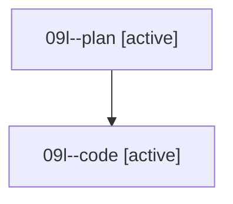

# Family: 09l

[Agent Hoods](../README.md) / [bbugyi200](../users/bbugyi200/README.md) / [athena](../users/bbugyi200/machines/athena/README.md) / [09l](../users/bbugyi200/machines/athena/hoods/09l/README.md) / 09l

Owner: `bbugyi200.athena` · Hood: `09l` · Members: 2

## Lineage

The diagram is an optional enhancement; the ordered table below contains the same lineage in accessible text.

| Role | Agent | State | Model / provider | Timing | Commits | Prompt | Chat |
|---|---|---|---|---|---:|---|---|
| plan | 09l--plan | active | gpt-5.6-sol / codex | 2026-08-21T15:07:38.256873+00:00 | 0 | [Prompt](../agents/bbugyi200.athena.09l--plan/prompt.md) | [Chat](../agents/bbugyi200.athena.09l--plan/chat.md) |
| code | 09l--code | active | grok-4.6 / grok | 2026-08-21T15:23:29.253008+00:00 | [1](../agents/bbugyi200.athena.09l--code/README.md#commits) | — | — |

## Commits

| Role | Repo | Commit | Subject | Committed |
|---|---|---|---|---|
| code | sase | [`68f82ce`](https://github.com/sase-org/sase/commit/68f82cef629779f1c32b09afc7cc68c73cbdf4de) | feat(ace): restore live output for session-local procs | 2026-08-21 16:21:43 UTC |
