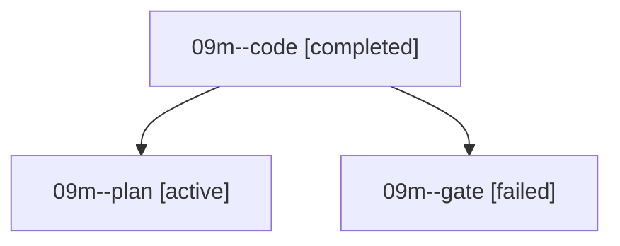

# Family: 09m

[Agent Hoods](../README.md) / [bbugyi200](../users/bbugyi200/README.md) / [athena](../users/bbugyi200/machines/athena/README.md) / [09m](../users/bbugyi200/machines/athena/hoods/09m/README.md) / 09m

Owner: `bbugyi200.athena` · Hood: `09m` · Members: 3

## Lineage

The diagram is an optional enhancement; the ordered table below contains the same lineage in accessible text.

| Role | Agent | State | Model / provider | Timing | Commits | Prompt | Chat |
|---|---|---|---|---|---:|---|---|
| code | 09m--code | completed | gpt-5.5 / codex | 2026-09-08T18:09:54.543446+00:00 → 2026-09-08T19:24:17.884854+00:00 | [1](../agents/bbugyi200.athena.09m--code/README.md#commits) | [Prompt](../agents/bbugyi200.athena.09m--code/prompt.md) | [Chat](../agents/bbugyi200.athena.09m--code/chat.md) |
| plan | 09m--plan | active | claude-fable-5 / claude | 2026-09-08T17:50:37.880020+00:00 | 0 | [Prompt](../agents/bbugyi200.athena.09m--plan/prompt.md) | [Chat](../agents/bbugyi200.athena.09m--plan/chat.md) |
| gate | 09m--gate | failed | claude-fable-5 / claude | 2026-09-08T18:03:04.682680+00:00 → 2026-09-08T18:09:22.320965+00:00 | 0 | — | [Chat](../agents/bbugyi200.athena.09m--gate/chat.md) |

## Commits

| Role | Repo | Commit | Subject | Committed |
|---|---|---|---|---|
| — | sase | [`2ffac01`](https://github.com/sase-org/sase/commit/2ffac01b3dd09a1914ff79df79629c1ed883a27b) | chore: Add SDD prompt and plan for per\_commit\_diffs\_and\_deltas | 2026-06-29 08:27:49 EDT |
| — | sase | [`9b93600`](https://github.com/sase-org/sase/commit/9b93600a48913f3cb6f63d60d59310dae960847e) | feat(tui): surface persisted commit diffs | 2026-06-29 09:13:30 EDT |
| code | sase | [`a37e1fb`](https://github.com/sase-org/sase/commit/a37e1fbaa0814875571e1bae01aadb27d958cde5) | fix(gate-shell): preserve follow-up workspace claims | 2026-09-08 15:20:31 EDT |
