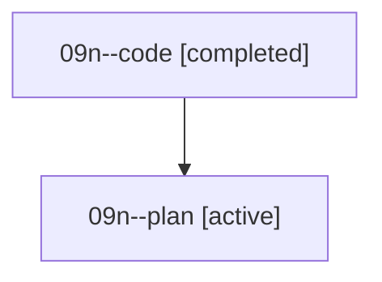

# Family: 09n

[Agent Hoods](../README.md) / [bbugyi200](../users/bbugyi200/README.md) / [athena](../users/bbugyi200/machines/athena/README.md) / [09n](../users/bbugyi200/machines/athena/hoods/09n/README.md) / 09n

Owner: `bbugyi200.athena` · Hood: `09n` · Members: 2

## Lineage

The diagram is an optional enhancement; the ordered table below contains the same lineage in accessible text.

| Role | Agent | State | Model / provider | Timing | Commits | Prompt | Chat |
|---|---|---|---|---|---:|---|---|
| code | 09n--code | completed | grok-4.6 / grok | 2026-08-21T15:16:06.635907+00:00 | [1](../agents/bbugyi200.athena.09n--code/README.md#commits) | — | [Chat](../agents/bbugyi200.athena.09n--code/chat.md) |
| plan | 09n--plan | active | gpt-5.6-sol / codex | 2026-08-21T15:08:52.272380+00:00 | 0 | [Prompt](../agents/bbugyi200.athena.09n--plan/prompt.md) | [Chat](../agents/bbugyi200.athena.09n--plan/chat.md) |

## Commits

| Role | Repo | Commit | Subject | Committed |
|---|---|---|---|---|
| code | sase | [`41f9a5a`](https://github.com/sase-org/sase/commit/41f9a5a29b4844579ab6fe2713f73732fd98e527) | feat(flags): add compact statistics footer to sase flag list | 2026-08-21 11:55:28 EDT |
