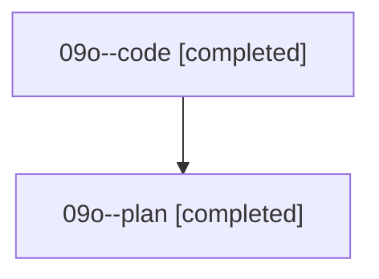

# Family: 09o

[Agent Hoods](../README.md) / [bbugyi200](../users/bbugyi200/README.md) / [athena](../users/bbugyi200/machines/athena/README.md) / [09o](../users/bbugyi200/machines/athena/hoods/09o/README.md) / 09o

Owner: `bbugyi200.athena` · Hood: `09o` · Members: 2

## Lineage

The diagram is an optional enhancement; the ordered table below contains the same lineage in accessible text.

| Role | Agent | State | Model / provider | Timing | Commits | Prompt | Chat |
|---|---|---|---|---|---:|---|---|
| code | 09o--code | completed | grok-4.6 / grok | 2026-08-21T15:49:09.769001+00:00 | [1](../agents/bbugyi200.athena.09o--code/README.md#commits) | — | [Chat](../agents/bbugyi200.athena.09o--code/chat.md) |
| plan | 09o--plan | completed | gpt-5.6-sol / codex | 2026-08-21T15:32:58.690843+00:00 | 0 | [Prompt](../agents/bbugyi200.athena.09o--plan/prompt.md) | [Chat](../agents/bbugyi200.athena.09o--plan/chat.md) |

## Commits

| Role | Repo | Commit | Subject | Committed |
|---|---|---|---|---|
| code | sase | [`3938c4c`](https://github.com/sase-org/sase/commit/3938c4cf0b1b1a51ce0fa28a21e2dded1c842ca7) | fix(commit): attribute resumed markers to the checkpointed repository | 2026-08-21 16:35:23 UTC |
