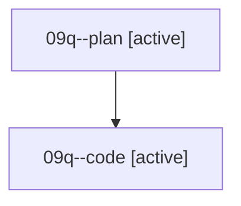

# Family: 09q

[Agent Hoods](../README.md) / [bbugyi200](../users/bbugyi200/README.md) / [athena](../users/bbugyi200/machines/athena/README.md) / [09q](../users/bbugyi200/machines/athena/hoods/09q/README.md) / 09q

Owner: `bbugyi200.athena` · Hood: `09q` · Members: 2

## Lineage

The diagram is an optional enhancement; the ordered table below contains the same lineage in accessible text.

| Role | Agent | State | Model / provider | Timing | Commits | Prompt | Chat |
|---|---|---|---|---|---:|---|---|
| plan | 09q--plan | active | gpt-5.6-sol / codex | 2026-08-21T15:50:23.282203+00:00 | 0 | [Prompt](../agents/bbugyi200.athena.09q--plan/prompt.md) | [Chat](../agents/bbugyi200.athena.09q--plan/chat.md) |
| code | 09q--code | active | grok-4.6 / grok | 2026-08-21T16:00:43.547865+00:00 | 0 | — | — |
