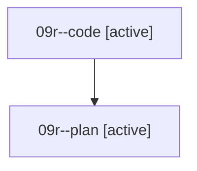

# Family: 09r

[Agent Hoods](../README.md) / [bbugyi200](../users/bbugyi200/README.md) / [athena](../users/bbugyi200/machines/athena/README.md) / [09r](../users/bbugyi200/machines/athena/hoods/09r/README.md) / 09r

Owner: `bbugyi200.athena` · Hood: `09r` · Members: 2

## Lineage

The diagram is an optional enhancement; the ordered table below contains the same lineage in accessible text.

| Role | Agent | State | Model / provider | Timing | Commits | Prompt | Chat |
|---|---|---|---|---|---:|---|---|
| code | 09r--code | active | grok-4.6 / grok | 2026-08-21T16:09:06.627103+00:00 | 0 | — | — |
| plan | 09r--plan | active | gpt-5.6-sol / codex | 2026-08-21T16:00:43.352888+00:00 | 0 | [Prompt](../agents/bbugyi200.athena.09r--plan/prompt.md) | [Chat](../agents/bbugyi200.athena.09r--plan/chat.md) |

## Commits

| Role | Repo | Commit | Subject | Committed |
|---|---|---|---|---|
| — | sase | [`d44ab2e`](https://github.com/sase-org/sase/commit/d44ab2ea82e1756f5a34d2d5b72880c595d2eda8) | chore: Add SDD prompt and plan for auto\_approve\_plan\_mode\_commits\_tale | 2026-06-29 08:56:19 EDT |
| — | sase | [`a3e494d`](https://github.com/sase-org/sase/commit/a3e494d93859235c30a0caa81ead36570bd7dc6b) | fix: keep auto plan approvals non-committing | 2026-06-29 09:08:01 EDT |
