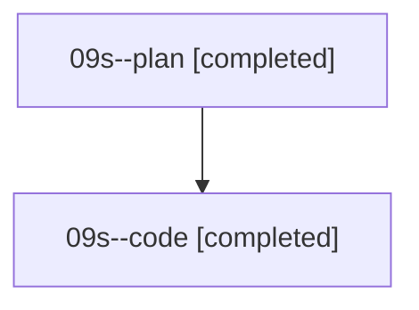

# Family: 09s

[Agent Hoods](../README.md) / [bbugyi200](../users/bbugyi200/README.md) / [athena](../users/bbugyi200/machines/athena/README.md) / [09s](../users/bbugyi200/machines/athena/hoods/09s/README.md) / 09s

Owner: `bbugyi200.athena` · Hood: `09s` · Members: 2

## Lineage

The diagram is an optional enhancement; the ordered table below contains the same lineage in accessible text.

| Role | Agent | State | Model / provider | Timing | Commits | Prompt | Chat |
|---|---|---|---|---|---:|---|---|
| plan | 09s--plan | completed | gpt-5.6-sol / codex | 2026-08-21T16:39:02.949567+00:00 → 2026-08-21T17:46:06.779088+00:00 | 0 | [Prompt](../agents/bbugyi200.athena.09s--plan/prompt.md) | [Chat](../agents/bbugyi200.athena.09s--plan/chat.md) |
| code | 09s--code | completed | grok-4.6 / grok | 2026-08-21T16:51:47.988524+00:00 → 2026-08-21T17:46:06.779088+00:00 | [1](../agents/bbugyi200.athena.09s--code/README.md#commits) | — | [Chat](../agents/bbugyi200.athena.09s--code/chat.md) |

## Commits

| Role | Repo | Commit | Subject | Committed |
|---|---|---|---|---|
| — | sase | [`76aafc7`](https://github.com/sase-org/sase/commit/76aafc727c521abe6b1bd0c268d6a392d0e1b773) | chore: Add SDD prompt and plan for wait\_time\_countdown\_after\_deps | 2026-06-29 13:23:43 UTC |
| — | sase | [`eaeff11`](https://github.com/sase-org/sase/commit/eaeff119de8167dc7b7602a3106801c76e1eb63e) | fix: start dependency wait duration after deps are ready | 2026-06-29 13:38:45 UTC |
| code | sase | [`0a1aef7`](https://github.com/sase-org/sase/commit/0a1aef7d80cd755b3f55ea62ee8aa4e69759daca) | feat(artifact-links): persist sidecar indexes on mutate and finalize | 2026-08-21 17:45:29 UTC |
