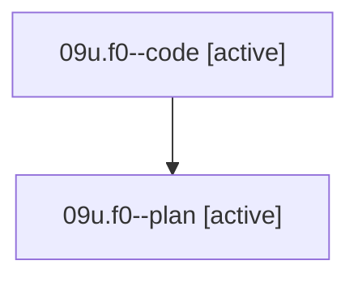

# Family: 09u.f0

[Agent Hoods](../README.md) / [bbugyi200](../users/bbugyi200/README.md) / [athena](../users/bbugyi200/machines/athena/README.md) / [09u](../users/bbugyi200/machines/athena/hoods/09u/README.md) / 09u.f0

Owner: `bbugyi200.athena` · Hood: `09u` · Members: 2

## Lineage

The diagram is an optional enhancement; the ordered table below contains the same lineage in accessible text.

| Role | Agent | State | Model / provider | Timing | Commits | Prompt | Chat |
|---|---|---|---|---|---:|---|---|
| code | 09u.f0--code | active | gpt-5.5 / codex | 2026-08-21T18:59:28.521203+00:00 | [1](../agents/bbugyi200.athena.09u.f0--code/README.md#commits) | — | — |
| plan | 09u.f0--plan | active | gpt-5.6-sol / codex | 2026-08-21T18:54:13.474986+00:00 | 0 | [Prompt](../agents/bbugyi200.athena.09u.f0--plan/prompt.md) | [Chat](../agents/bbugyi200.athena.09u.f0--plan/chat.md) |

## Commits

| Role | Repo | Commit | Subject | Committed |
|---|---|---|---|---|
| code | sase | [`d864fa9`](https://github.com/sase-org/sase/commit/d864fa9493731f4c88338142c1fae0b9674e1c53) | fix(ace): compact bead wait status tokens | 2026-08-21 19:32:15 UTC |

## Neighbors

| Agent | Relation | State |
|---|---|---|
| [09u](../agents/bbugyi200.athena.09u/README.md) | ancestor | completed |
