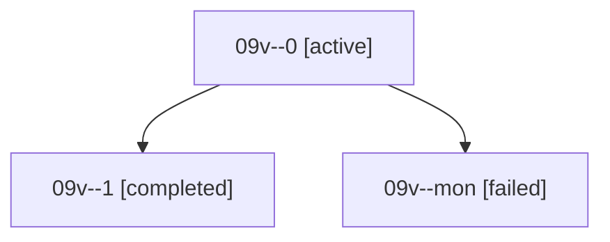

# Family: 09v

[Agent Hoods](../README.md) / [bbugyi200](../users/bbugyi200/README.md) / [athena](../users/bbugyi200/machines/athena/README.md) / [09v](../users/bbugyi200/machines/athena/hoods/09v/README.md) / 09v

Owner: `bbugyi200.athena` · Hood: `09v` · Members: 3

## Lineage

The diagram is an optional enhancement; the ordered table below contains the same lineage in accessible text.

| Role | Agent | State | Model / provider | Timing | Commits | Prompt | Chat |
|---|---|---|---|---|---:|---|---|
| 0 | 09v--0 | active | grok-4.6 / grok | 2026-08-21T17:42:41.515099+00:00 | 0 | [Prompt](../agents/bbugyi200.athena.09v--0/prompt.md) | [Chat](../agents/bbugyi200.athena.09v--0/chat.md) |
| 1 | 09v--1 | completed | grok-4.6 / grok | 2026-08-21T18:22:23.983992+00:00 → 2026-08-21T18:28:22.422123+00:00 | [1](../agents/bbugyi200.athena.09v--1/README.md#commits) | [Prompt](../agents/bbugyi200.athena.09v--1/prompt.md) | [Chat](../agents/bbugyi200.athena.09v--1/chat.md) |
| mon | 09v--mon | failed | grok-4.6 / grok | 2026-08-21T18:20:31.683907+00:00 | 0 | — | [Chat](../agents/bbugyi200.athena.09v--mon/chat.md) |

## Commits

| Role | Repo | Commit | Subject | Committed |
|---|---|---|---|---|
| — | sase | [`70322a3`](https://github.com/sase-org/sase/commit/70322a35ebfb0f76c264f50ac14711c5a13d262d) | chore: Add SDD prompt and plan for fix\_coverage\_load\_test\_flakes | 2026-06-29 10:12:42 EDT |
| — | sase | [`1a9c06b`](https://github.com/sase-org/sase/commit/1a9c06b2caf2fab3d26df397921ac3eb9117218e) | fix: stop provider timer threads under load | 2026-06-29 10:27:20 EDT |
| 1 | sase | [`fded7a5`](https://github.com/sase-org/sase/commit/fded7a5d15eb31b208d586487c29cc63b3baece2) | feat(artifact-refs): expand citations as portable prose | 2026-08-21 14:24:42 EDT |
