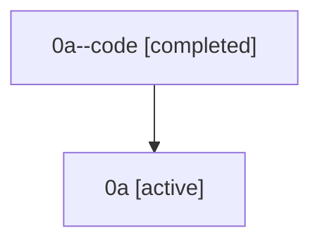

# Family: 0a

[Agent Hoods](../README.md) / [bbugyi200](../users/bbugyi200/README.md) / [athena](../users/bbugyi200/machines/athena/README.md) / [0a](../users/bbugyi200/machines/athena/hoods/0a/README.md) / 0a

Owner: `bbugyi200.athena` · Hood: `0a` · Members: 2

## Lineage

The diagram is an optional enhancement; the ordered table below contains the same lineage in accessible text.

| Role | Agent | State | Model / provider | Timing | Commits | Prompt | Chat |
|---|---|---|---|---|---:|---|---|
| code | 0a--code | completed | gpt-5.5 / codex | 2026-07-07T04:49:38.991039+00:00 | [1](../agents/bbugyi200.athena.0a--code/README.md#commits) | — | [Chat](../agents/bbugyi200.athena.0a--code/chat.md) |
| root | 0a | active | claude-fable-5 / claude | 2026-07-07T04:33:43.021325+00:00 | [1](../agents/bbugyi200.athena.0a/README.md#commits) | [Prompt](../agents/bbugyi200.athena.0a/prompt.md) | [Chat](../agents/bbugyi200.athena.0a/chat.md) |

## Commits

| Role | Repo | Commit | Subject | Committed |
|---|---|---|---|---|
| root | sase | [`b93621d`](https://github.com/sase-org/sase/commit/b93621dbfb43171f826cacb8dfb46a910a9852fa) | chore: Add SDD prompt and plan for demo\_gif\_polish | 2026-07-07 04:49:37 UTC |
| code | sase | [`9b6adb9`](https://github.com/sase-org/sase/commit/9b6adb94c3da8f0e34ba95278e3e8de07e094f19) | fix(demos): polish ace demo captures | 2026-07-07 05:07:03 UTC |
