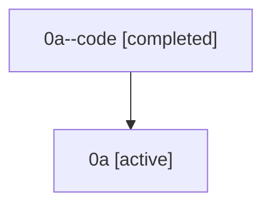

# Family: 0a

Owner: `bbugyi200.athena` · Hood: `0a` · Members: 2

## Lineage

The diagram is an optional enhancement; the ordered table below contains the same lineage in accessible text.

| Role | Agent | State | Model / provider | Timing | Commits | Prompt | Chat |
|---|---|---|---|---|---:|---|---|
| code | 0a--code | completed | gpt-5.5 / codex | 2026-07-07T04:49:38.991039+00:00 | 1 | — | [Chat](../agents/bbugyi200.athena.0a--code/chat.md) |
| root | 0a | active | claude-fable-5 / claude | 2026-07-07T04:33:43.021325+00:00 | 2 | [Prompt](../agents/bbugyi200.athena.0a/prompt.md) | [Chat](../agents/bbugyi200.athena.0a/chat.md) |
