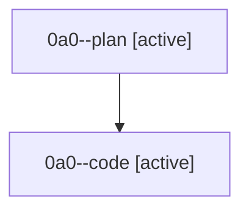

# Family: 0a0

[Agent Hoods](../README.md) / [bbugyi200](../users/bbugyi200/README.md) / [athena](../users/bbugyi200/machines/athena/README.md) / [0a0](../users/bbugyi200/machines/athena/hoods/0a0/README.md) / 0a0

Owner: `bbugyi200.athena` · Hood: `0a0` · Members: 2

## Lineage

The diagram is an optional enhancement; the ordered table below contains the same lineage in accessible text.

| Role | Agent | State | Model / provider | Timing | Commits | Prompt | Chat |
|---|---|---|---|---|---:|---|---|
| plan | 0a0--plan | active | gpt-5.6-sol / codex | 2026-08-21T18:19:12.569888+00:00 | 0 | [Prompt](../agents/bbugyi200.athena.0a0--plan/prompt.md) | [Chat](../agents/bbugyi200.athena.0a0--plan/chat.md) |
| code | 0a0--code | active | grok-4.6 / grok | 2026-08-21T18:26:28.684249+00:00 | [1](../agents/bbugyi200.athena.0a0--code/README.md#commits) | — | — |

## Commits

| Role | Repo | Commit | Subject | Committed |
|---|---|---|---|---|
| — | sase | [`9202845`](https://github.com/sase-org/sase/commit/9202845c12c3799c57ff868efbc305df57197754) | chore: Add SDD prompt and plan for wait\_time\_concise\_live\_countdown | 2026-06-29 14:31:55 UTC |
| — | sase | [`1261bfe`](https://github.com/sase-org/sase/commit/1261bfeaefa67d5ee806422a69a71a8e40afea53) | feat(tui): show concise wait countdown rows | 2026-06-29 14:45:19 UTC |
| code | sase | [`1cc5a23`](https://github.com/sase-org/sase/commit/1cc5a239af8693ca16c8899686bb3f9556b68d40) | fix(attachments): isolate Pandoc scratch from Git worktrees | 2026-08-21 18:47:10 UTC |
