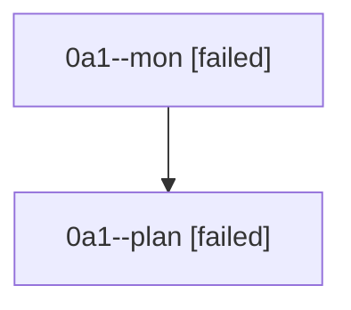

# Family: 0a1

[Agent Hoods](../README.md) / [bbugyi200](../users/bbugyi200/README.md) / [athena](../users/bbugyi200/machines/athena/README.md) / [0a1](../users/bbugyi200/machines/athena/hoods/0a1/README.md) / 0a1

Owner: `bbugyi200.athena` · Hood: `0a1` · Members: 2

## Lineage

The diagram is an optional enhancement; the ordered table below contains the same lineage in accessible text.

| Role | Agent | State | Model / provider | Timing | Commits | Prompt | Chat |
|---|---|---|---|---|---:|---|---|
| mon | 0a1--mon | failed | gpt-5.6-sol / codex | 2026-08-21T18:56:00.965054+00:00 | 0 | — | [Chat](../agents/bbugyi200.athena.0a1--mon/chat.md) |
| plan | 0a1--plan | failed | gpt-5.6-sol / codex | 2026-08-21T18:51:16.495651+00:00 → 2026-08-21T18:55:38.789345+00:00 | 0 | [Prompt](../agents/bbugyi200.athena.0a1--plan/prompt.md) | [Chat](../agents/bbugyi200.athena.0a1--plan/chat.md) |

## Commits

| Role | Repo | Commit | Subject | Committed |
|---|---|---|---|---|
| — | sase | [`9d3ff15`](https://github.com/sase-org/sase/commit/9d3ff15eb902e747c1db23c4bcdfb12ffd465ef1) | chore: Add SDD prompt and plan for vcs\_xprompt\_mru\_all\_launch\_paths | 2026-06-29 14:39:54 UTC |
| — | sase | [`669ecfe`](https://github.com/sase-org/sase/commit/669ecfee73629bc256859990a066f1adc34ee049) | fix: record VCS xprompt MRU for launch paths | 2026-06-29 14:58:33 UTC |
