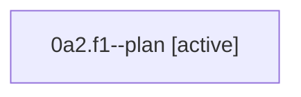

# Family: 0a2.f1

[Agent Hoods](../README.md) / [bbugyi200](../users/bbugyi200/README.md) / [athena](../users/bbugyi200/machines/athena/README.md) / [0a2](../users/bbugyi200/machines/athena/hoods/0a2/README.md) / 0a2.f1

Owner: `bbugyi200.athena` · Hood: `0a2` · Members: 1

## Lineage

The diagram is an optional enhancement; the ordered table below contains the same lineage in accessible text.

| Role | Agent | State | Model / provider | Timing | Commits | Prompt | Chat |
|---|---|---|---|---|---:|---|---|
| plan | 0a2.f1--plan | active | gpt-5.6-sol / codex | 2026-08-21T19:58:14.729176+00:00 | 0 | [Prompt](../agents/bbugyi200.athena.0a2.f1--plan/prompt.md) | [Chat](../agents/bbugyi200.athena.0a2.f1--plan/chat.md) |

## Neighbors

| Agent | Relation | State |
|---|---|---|
| [0a2](../agents/bbugyi200.athena.0a2/README.md) | ancestor | completed |
