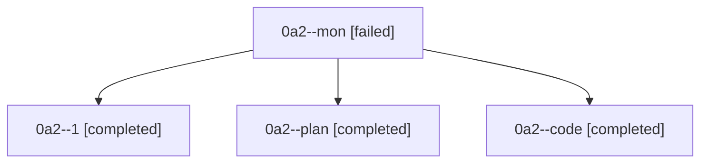

# Family: 0a2

[Agent Hoods](../README.md) / [bbugyi200](../users/bbugyi200/README.md) / [athena](../users/bbugyi200/machines/athena/README.md) / [0a2](../users/bbugyi200/machines/athena/hoods/0a2/README.md) / 0a2

Owner: `bbugyi200.athena` · Hood: `0a2` · Members: 4

## Lineage

The diagram is an optional enhancement; the ordered table below contains the same lineage in accessible text.

| Role | Agent | State | Model / provider | Timing | Commits | Prompt | Chat |
|---|---|---|---|---|---:|---|---|
| mon | 0a2--mon | failed | grok-4.6 / grok | 2026-08-21T19:47:28.951283+00:00 | 0 | — | [Chat](../agents/bbugyi200.athena.0a2--mon/chat.md) |
| 1 | 0a2--1 | completed | grok-4.6 / grok | 2026-08-21T19:49:54.478736+00:00 → 2026-08-21T19:58:39.072743+00:00 | 0 | [Prompt](../agents/bbugyi200.athena.0a2--1/prompt.md) | [Chat](../agents/bbugyi200.athena.0a2--1/chat.md) |
| plan | 0a2--plan | completed | gpt-5.6-sol / codex | 2026-08-21T19:03:44.564392+00:00 → 2026-08-21T19:48:08.800761+00:00 | 0 | [Prompt](../agents/bbugyi200.athena.0a2--plan/prompt.md) | [Chat](../agents/bbugyi200.athena.0a2--plan/chat.md) |
| code | 0a2--code | completed | grok-4.6 / grok | 2026-08-21T19:10:56.497213+00:00 → 2026-08-21T19:48:08.800761+00:00 | 0 | — | [Chat](../agents/bbugyi200.athena.0a2--code/chat.md) |

## Commits

| Role | Repo | Commit | Subject | Committed |
|---|---|---|---|---|
| — | sase | [`03e3032`](https://github.com/sase-org/sase/commit/03e30320f0fea747c33accbb335b2301ae2c8900) | chore: Add SDD prompt and plan for post\_update\_version\_toast | 2026-06-29 10:54:13 EDT |
| — | sase | [`b02dd41`](https://github.com/sase-org/sase/commit/b02dd4197175ccec6616349ca196c61fd80f6438) | feat(ace): show post-update version toast | 2026-06-29 11:11:29 EDT |
| — | sase | [`fcbe276`](https://github.com/sase-org/sase/commit/fcbe276098ef7028d0dcb3ef55b7aedafb5543a7) | feat(ace): add Config sub-tab description rail | 2026-08-21 15:56:22 EDT |

## Neighbors

| Agent | Relation | State |
|---|---|---|
| [0a2.f1](bbugyi200.athena.0a2.f1.md) (family · 2) | descendant | active 2 |
