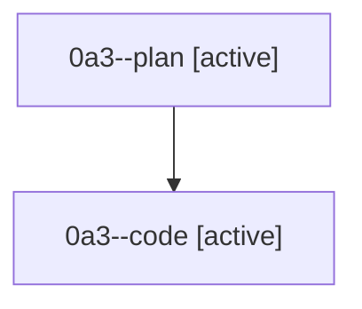

# Family: 0a3

[Agent Hoods](../README.md) / [bbugyi200](../users/bbugyi200/README.md) / [athena](../users/bbugyi200/machines/athena/README.md) / [0a3](../users/bbugyi200/machines/athena/hoods/0a3/README.md) / 0a3

Owner: `bbugyi200.athena` · Hood: `0a3` · Members: 2

## Lineage

The diagram is an optional enhancement; the ordered table below contains the same lineage in accessible text.

| Role | Agent | State | Model / provider | Timing | Commits | Prompt | Chat |
|---|---|---|---|---|---:|---|---|
| plan | 0a3--plan | active | gpt-5.6-sol / codex | 2026-08-21T19:10:51.932233+00:00 | 0 | [Prompt](../agents/bbugyi200.athena.0a3--plan/prompt.md) | [Chat](../agents/bbugyi200.athena.0a3--plan/chat.md) |
| code | 0a3--code | active | gpt-5.5 / codex | 2026-08-21T19:30:39.220441+00:00 | 0 | — | — |

## Commits

| Role | Repo | Commit | Subject | Committed |
|---|---|---|---|---|
| — | sase | [`ad98a7e`](https://github.com/sase-org/sase/commit/ad98a7e9a5175a3d753d48ae82310694889d9753) | chore: Add SDD prompt and plan for updates\_tab\_keymap\_rework | 2026-06-29 15:39:05 UTC |
| — | sase | [`c095d43`](https://github.com/sase-org/sase/commit/c095d438d9ce42eaf10f800e5ed9defe69ee47d4) | feat!: rework plugin update keybindings | 2026-06-29 15:54:15 UTC |
