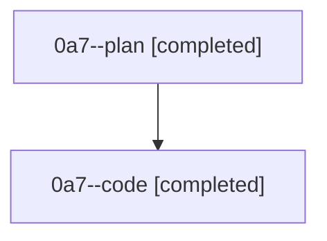

# Family: 0a7

[Agent Hoods](../README.md) / [bbugyi200](../users/bbugyi200/README.md) / [athena](../users/bbugyi200/machines/athena/README.md) / [0a7](../users/bbugyi200/machines/athena/hoods/0a7/README.md) / 0a7

Owner: `bbugyi200.athena` · Hood: `0a7` · Members: 2

## Lineage

The diagram is an optional enhancement; the ordered table below contains the same lineage in accessible text.

| Role | Agent | State | Model / provider | Timing | Commits | Prompt | Chat |
|---|---|---|---|---|---:|---|---|
| plan | 0a7--plan | completed | gpt-5.6-sol / codex | 2026-08-21T20:07:21.894863+00:00 → 2026-08-21T20:17:12.911095+00:00 | 0 | [Prompt](../agents/bbugyi200.athena.0a7--plan/prompt.md) | [Chat](../agents/bbugyi200.athena.0a7--plan/chat.md) |
| code | 0a7--code | completed | gpt-5.5 / codex | 2026-08-21T20:09:57.957286+00:00 → 2026-08-21T20:17:12.911095+00:00 | 0 | — | [Chat](../agents/bbugyi200.athena.0a7--code/chat.md) |
