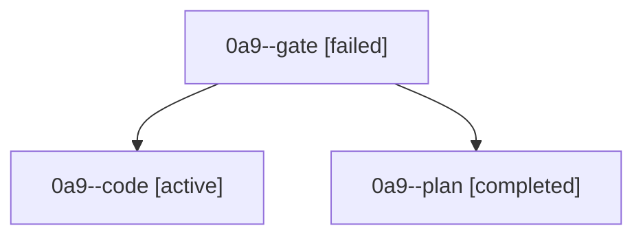

# Family: 0a9

[Agent Hoods](../README.md) / [bbugyi200](../users/bbugyi200/README.md) / [athena](../users/bbugyi200/machines/athena/README.md) / [0a9](../users/bbugyi200/machines/athena/hoods/0a9/README.md) / 0a9

Owner: `bbugyi200.athena` · Hood: `0a9` · Members: 3

## Lineage

The diagram is an optional enhancement; the ordered table below contains the same lineage in accessible text.

| Role | Agent | State | Model / provider | Timing | Commits | Prompt | Chat |
|---|---|---|---|---|---:|---|---|
| gate | 0a9--gate | failed | claude-fable-5 / claude | 2026-09-08T22:08:35.781879+00:00 → 2026-09-09T08:37:20.613069+00:00 | 0 | — | [Chat](../agents/bbugyi200.athena.0a9--gate/chat.md) |
| code | 0a9--code | active | gpt-5.5 / codex | 2026-09-09T08:37:27.171746+00:00 | [1](../agents/bbugyi200.athena.0a9--code/README.md#commits) | [Prompt](../agents/bbugyi200.athena.0a9--code/prompt.md) | — |
| plan | 0a9--plan | completed | claude-fable-5 / claude | 2026-09-08T21:52:02.893475+00:00 → 2026-09-08T22:08:49.531875+00:00 | 0 | [Prompt](../agents/bbugyi200.athena.0a9--plan/prompt.md) | [Chat](../agents/bbugyi200.athena.0a9--plan/chat.md) |

## Commits

| Role | Repo | Commit | Subject | Committed |
|---|---|---|---|---|
| — | sase | [`e0addf7`](https://github.com/sase-org/sase/commit/e0addf7f223d96b3a15f21dc1de40b9e046a3e82) | chore: Add SDD prompt and plan for fix\_axe\_daemon\_sigterm\_handler\_race | 2026-06-29 12:46:33 EDT |
| — | sase | [`98d5df8`](https://github.com/sase-org/sase/commit/98d5df888895bc94346c63b9c068861eb54503f6) | test: install axe SIGTERM handler before readiness | 2026-06-29 12:51:20 EDT |
| code | sase | [`3b338c2`](https://github.com/sase-org/sase/commit/3b338c208a4252aeea9fdd023d0f6763eb4514e0) | perf(wait-deps): cache artifact directory lookups | 2026-09-09 05:13:02 EDT |

## Neighbors

| Agent | Relation | State |
|---|---|---|
| [0a9.f1](../agents/bbugyi200.athena.0a9.f1/README.md) | descendant | completed |
