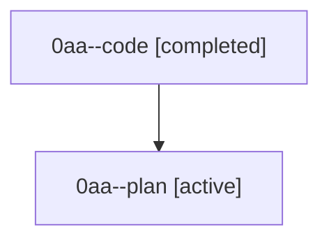

# Family: 0aa

[Agent Hoods](../README.md) / [bbugyi200](../users/bbugyi200/README.md) / [athena](../users/bbugyi200/machines/athena/README.md) / [0aa](../users/bbugyi200/machines/athena/hoods/0aa/README.md) / 0aa

Owner: `bbugyi200.athena` · Hood: `0aa` · Members: 2

## Lineage

The diagram is an optional enhancement; the ordered table below contains the same lineage in accessible text.

| Role | Agent | State | Model / provider | Timing | Commits | Prompt | Chat |
|---|---|---|---|---|---:|---|---|
| code | 0aa--code | completed | gpt-5.5 / codex | 2026-08-22T10:43:26.388057+00:00 → 2026-08-22T11:16:11.113609+00:00 | [1](../agents/bbugyi200.athena.0aa--code/README.md#commits) | — | [Chat](../agents/bbugyi200.athena.0aa--code/chat.md) |
| plan | 0aa--plan | active | gpt-5.6-sol / codex | 2026-08-22T10:28:35.389062+00:00 | 0 | [Prompt](../agents/bbugyi200.athena.0aa--plan/prompt.md) | [Chat](../agents/bbugyi200.athena.0aa--plan/chat.md) |

## Commits

| Role | Repo | Commit | Subject | Committed |
|---|---|---|---|---|
| code | sase | [`b1327af`](https://github.com/sase-org/sase/commit/b1327affef876dc5532b713fb07dbaed1ed577f6) | test: expose final directive in ACE completions | 2026-08-22 07:14:59 EDT |

## Neighbors

| Agent | Relation | State |
|---|---|---|
| [0aa.cld.f1](../agents/bbugyi200.athena.0aa.cld.f1/README.md) | descendant | completed |
