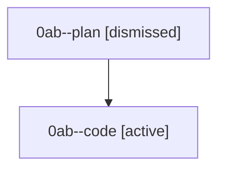

# Family: 0ab

[Agent Hoods](../README.md) / [bbugyi200](../users/bbugyi200/README.md) / [athena](../users/bbugyi200/machines/athena/README.md) / [0ab](../users/bbugyi200/machines/athena/hoods/0ab/README.md) / 0ab

Owner: `bbugyi200.athena` · Hood: `0ab` · Members: 2

## Lineage

The diagram is an optional enhancement; the ordered table below contains the same lineage in accessible text.

| Role | Agent | State | Model / provider | Timing | Commits | Prompt | Chat |
|---|---|---|---|---|---:|---|---|
| plan | 0ab--plan | dismissed | — | 2026-08-22T10:30:42 | 0 | — | — |
| code | 0ab--code | active | gpt-5.5 / codex | 2026-08-22T10:38:02.520179+00:00 | 0 | — | — |
