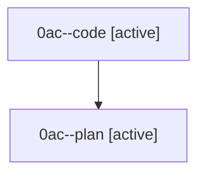

# Family: 0ac

[Agent Hoods](../README.md) / [bbugyi200](../users/bbugyi200/README.md) / [athena](../users/bbugyi200/machines/athena/README.md) / [0ac](../users/bbugyi200/machines/athena/hoods/0ac/README.md) / 0ac

Owner: `bbugyi200.athena` · Hood: `0ac` · Members: 2

## Lineage

The diagram is an optional enhancement; the ordered table below contains the same lineage in accessible text.

| Role | Agent | State | Model / provider | Timing | Commits | Prompt | Chat |
|---|---|---|---|---|---:|---|---|
| code | 0ac--code | active | grok-4.6 / grok | 2026-08-22T10:52:39.715435+00:00 | 0 | — | — |
| plan | 0ac--plan | active | gpt-5.6-sol / codex | 2026-08-22T10:37:07.489122+00:00 | 0 | [Prompt](../agents/bbugyi200.athena.0ac--plan/prompt.md) | [Chat](../agents/bbugyi200.athena.0ac--plan/chat.md) |

## Commits

| Role | Repo | Commit | Subject | Committed |
|---|---|---|---|---|
| — | sase | [`a79c174`](https://github.com/sase-org/sase/commit/a79c174797b0f8c92442e8d4003ca3c8fc679e10) | chore: Add SDD prompt and plan for neighbor\_keymap\_includes\_ancestors | 2026-06-29 16:59:31 UTC |
| — | sase | [`4ffd1f1`](https://github.com/sase-org/sase/commit/4ffd1f1442105cd333977ce15157fa349ea4cbc2) | feat(tui): include ancestors in agent neighbor jumps | 2026-06-29 17:10:59 UTC |
