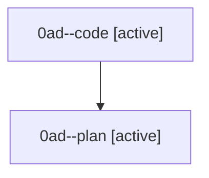

# Family: 0ad

[Agent Hoods](../README.md) / [bbugyi200](../users/bbugyi200/README.md) / [athena](../users/bbugyi200/machines/athena/README.md) / [0ad](../users/bbugyi200/machines/athena/hoods/0ad/README.md) / 0ad

Owner: `bbugyi200.athena` · Hood: `0ad` · Members: 2

## Lineage

The diagram is an optional enhancement; the ordered table below contains the same lineage in accessible text.

| Role | Agent | State | Model / provider | Timing | Commits | Prompt | Chat |
|---|---|---|---|---|---:|---|---|
| code | 0ad--code | active | grok-4.6 / grok | 2026-08-22T10:43:13.541114+00:00 | 0 | — | — |
| plan | 0ad--plan | active | gpt-5.6-sol / codex | 2026-08-22T10:37:38.998016+00:00 | 0 | [Prompt](../agents/bbugyi200.athena.0ad--plan/prompt.md) | [Chat](../agents/bbugyi200.athena.0ad--plan/chat.md) |

## Commits

| Role | Repo | Commit | Subject | Committed |
|---|---|---|---|---|
| — | sase | [`ecf50f6`](https://github.com/sase-org/sase/commit/ecf50f6975b72e94469198920f01d52c4bd10b3c) | chore: Add SDD prompt and plan for xprompt\_completion\_skip\_space\_before\_punctuation | 2026-06-29 17:17:17 UTC |
| — | sase | [`d1bc30f`](https://github.com/sase-org/sase/commit/d1bc30f9c2eeb371dcfb3073775ef794826894b6) | fix: skip xprompt completion space before punctuation | 2026-06-29 17:26:23 UTC |
