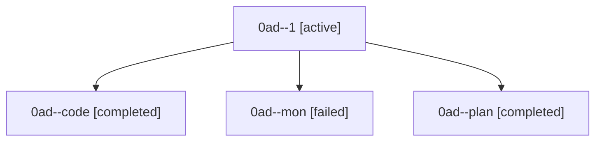

# Family: 0ad

[Agent Hoods](../README.md) / [bbugyi200](../users/bbugyi200/README.md) / [athena](../users/bbugyi200/machines/athena/README.md) / [0ad](../users/bbugyi200/machines/athena/hoods/0ad/README.md) / 0ad

Owner: `bbugyi200.athena` · Hood: `0ad` · Members: 4

## Lineage

The diagram is an optional enhancement; the ordered table below contains the same lineage in accessible text.

| Role | Agent | State | Model / provider | Timing | Commits | Prompt | Chat |
|---|---|---|---|---|---:|---|---|
| 1 | 0ad--1 | active | grok-4.6 / grok | 2026-08-22T11:53:36.234821+00:00 | [1](../agents/bbugyi200.athena.0ad--1/README.md#commits) | [Prompt](../agents/bbugyi200.athena.0ad--1/prompt.md) | — |
| code | 0ad--code | completed | grok-4.6 / grok | 2026-08-22T10:43:13.541114+00:00 → 2026-08-22T11:36:08.935437+00:00 | 0 | — | [Chat](../agents/bbugyi200.athena.0ad--code/chat.md) |
| mon | 0ad--mon | failed | grok-4.6 / grok | 2026-08-22T11:35:54.573886+00:00 | 0 | — | [Chat](../agents/bbugyi200.athena.0ad--mon/chat.md) |
| plan | 0ad--plan | completed | gpt-5.6-sol / codex | 2026-08-22T10:37:38.998016+00:00 → 2026-08-22T11:36:08.935437+00:00 | 0 | [Prompt](../agents/bbugyi200.athena.0ad--plan/prompt.md) | [Chat](../agents/bbugyi200.athena.0ad--plan/chat.md) |

## Commits

| Role | Repo | Commit | Subject | Committed |
|---|---|---|---|---|
| — | sase | [`ecf50f6`](https://github.com/sase-org/sase/commit/ecf50f6975b72e94469198920f01d52c4bd10b3c) | chore: Add SDD prompt and plan for xprompt\_completion\_skip\_space\_before\_punctuation | 2026-06-29 13:17:17 EDT |
| — | sase | [`d1bc30f`](https://github.com/sase-org/sase/commit/d1bc30f9c2eeb371dcfb3073775ef794826894b6) | fix: skip xprompt completion space before punctuation | 2026-06-29 13:26:23 EDT |
| 1 | sase | [`ab5099e`](https://github.com/sase-org/sase/commit/ab5099e203990f12cd2c4d44d48394d40fad9349) | feat(monitor): let follow-up agents select a model | 2026-08-22 08:02:28 EDT |
