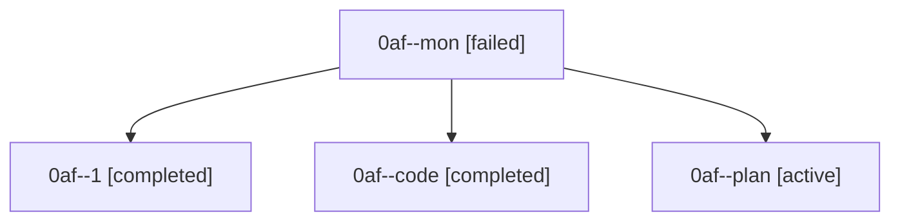

# Family: 0af

[Agent Hoods](../README.md) / [bbugyi200](../users/bbugyi200/README.md) / [athena](../users/bbugyi200/machines/athena/README.md) / [0af](../users/bbugyi200/machines/athena/hoods/0af/README.md) / 0af

Owner: `bbugyi200.athena` · Hood: `0af` · Members: 4

## Lineage

The diagram is an optional enhancement; the ordered table below contains the same lineage in accessible text.

| Role | Agent | State | Model / provider | Timing | Commits | Prompt | Chat |
|---|---|---|---|---|---:|---|---|
| mon | 0af--mon | failed | grok-4.6 / grok | 2026-08-22T12:08:45.500405+00:00 | 0 | — | [Chat](../agents/bbugyi200.athena.0af--mon/chat.md) |
| 1 | 0af--1 | completed | grok-4.6 / grok | 2026-08-22T12:25:19.918595+00:00 → 2026-08-22T12:39:49.385779+00:00 | [1](../agents/bbugyi200.athena.0af--1/README.md#commits) | [Prompt](../agents/bbugyi200.athena.0af--1/prompt.md) | [Chat](../agents/bbugyi200.athena.0af--1/chat.md) |
| code | 0af--code | completed | grok-4.6 / grok | 2026-08-22T11:18:59.400957+00:00 → 2026-08-22T12:09:03.894974+00:00 | 0 | — | [Chat](../agents/bbugyi200.athena.0af--code/chat.md) |
| plan | 0af--plan | active | gpt-5.6-sol / codex | 2026-08-22T11:07:05.676576+00:00 | 0 | [Prompt](../agents/bbugyi200.athena.0af--plan/prompt.md) | [Chat](../agents/bbugyi200.athena.0af--plan/chat.md) |

## Commits

| Role | Repo | Commit | Subject | Committed |
|---|---|---|---|---|
| — | sase | [`5474f44`](https://github.com/sase-org/sase/commit/5474f4491032de750e1f1ee2a524cf7dd0deb066) | fix: require sase-core-rs 0.3 | 2026-06-29 21:36:56 EDT |
| 1 | sase | [`a92c0b1`](https://github.com/sase-org/sase/commit/a92c0b1c01f9d6a842bb98aeb5967e13c4e5e1e1) | feat(bead): show provenance-aware artifact-link neighborhood | 2026-08-22 08:37:03 EDT |
