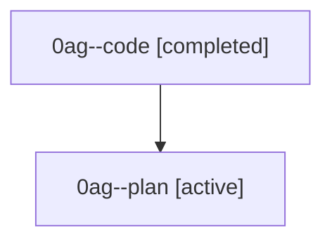

# Family: 0ag

[Agent Hoods](../README.md) / [bbugyi200](../users/bbugyi200/README.md) / [athena](../users/bbugyi200/machines/athena/README.md) / [0ag](../users/bbugyi200/machines/athena/hoods/0ag/README.md) / 0ag

Owner: `bbugyi200.athena` · Hood: `0ag` · Members: 2

## Lineage

The diagram is an optional enhancement; the ordered table below contains the same lineage in accessible text.

| Role | Agent | State | Model / provider | Timing | Commits | Prompt | Chat |
|---|---|---|---|---|---:|---|---|
| code | 0ag--code | completed | grok-4.6 / grok | 2026-08-22T11:18:15.537116+00:00 → 2026-08-22T11:39:48.258214+00:00 | 0 | — | [Chat](../agents/bbugyi200.athena.0ag--code/chat.md) |
| plan | 0ag--plan | active | gpt-5.6-sol / codex | 2026-08-22T11:14:09.482181+00:00 | 0 | [Prompt](../agents/bbugyi200.athena.0ag--plan/prompt.md) | [Chat](../agents/bbugyi200.athena.0ag--plan/chat.md) |

## Commits

| Role | Repo | Commit | Subject | Committed |
|---|---|---|---|---|
| — | sase | [`31c9895`](https://github.com/sase-org/sase/commit/31c98951ce0acb47910225275ff318c2a15b1c3a) | fix(dev-update): fetch release tags from upstream | 2026-06-30 05:22:53 EDT |
