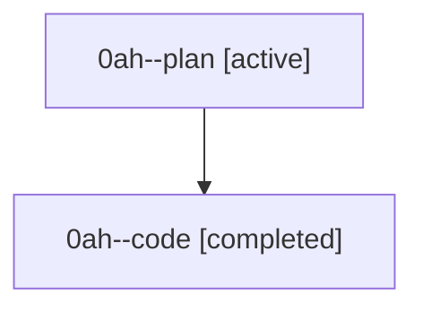

# Family: 0ah

[Agent Hoods](../README.md) / [bbugyi200](../users/bbugyi200/README.md) / [athena](../users/bbugyi200/machines/athena/README.md) / [0ah](../users/bbugyi200/machines/athena/hoods/0ah/README.md) / 0ah

Owner: `bbugyi200.athena` · Hood: `0ah` · Members: 2

## Lineage

The diagram is an optional enhancement; the ordered table below contains the same lineage in accessible text.

| Role | Agent | State | Model / provider | Timing | Commits | Prompt | Chat |
|---|---|---|---|---|---:|---|---|
| plan | 0ah--plan | active | gpt-5.6-sol / codex | 2026-08-22T11:15:03.834398+00:00 | 0 | [Prompt](../agents/bbugyi200.athena.0ah--plan/prompt.md) | [Chat](../agents/bbugyi200.athena.0ah--plan/chat.md) |
| code | 0ah--code | completed | gpt-5.5 / codex | 2026-08-22T11:19:45.586055+00:00 → 2026-08-22T11:27:42.965649+00:00 | 0 | — | [Chat](../agents/bbugyi200.athena.0ah--code/chat.md) |

## Commits

| Role | Repo | Commit | Subject | Committed |
|---|---|---|---|---|
| — | sase | [`7c5e5e1`](https://github.com/sase-org/sase/commit/7c5e5e1f9436a7ce0266c15ccd8b491e2ba9992d) | chore: Add SDD prompt and plan for agents\_onboarding\_visible\_gate | 2026-06-30 06:02:23 EDT |
| — | sase | [`f783204`](https://github.com/sase-org/sase/commit/f7832045b7ec7052a3454aef208a86786b68d413) | fix: show agents onboarding when no rows are visible | 2026-06-30 06:08:42 EDT |
