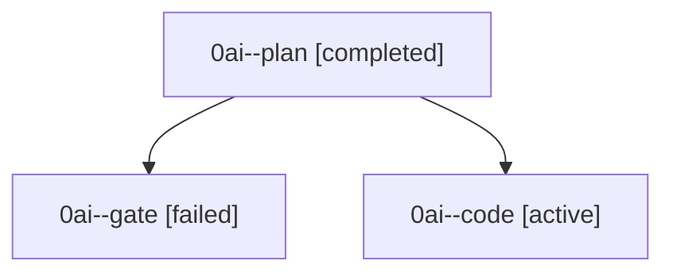

# Family: 0ai

[Agent Hoods](../README.md) / [bbugyi200](../users/bbugyi200/README.md) / [athena](../users/bbugyi200/machines/athena/README.md) / [0ai](../users/bbugyi200/machines/athena/hoods/0ai/README.md) / 0ai

Owner: `bbugyi200.athena` · Hood: `0ai` · Members: 3

## Lineage

The diagram is an optional enhancement; the ordered table below contains the same lineage in accessible text.

| Role | Agent | State | Model / provider | Timing | Commits | Prompt | Chat |
|---|---|---|---|---|---:|---|---|
| plan | 0ai--plan | completed | gpt-5.6-sol / codex | 2026-09-08T19:30:21.698893+00:00 → 2026-09-08T19:40:49.973293+00:00 | 0 | [Prompt](../agents/bbugyi200.athena.0ai--plan/prompt.md) | [Chat](../agents/bbugyi200.athena.0ai--plan/chat.md) |
| gate | 0ai--gate | failed | gpt-5.6-sol / codex | 2026-09-08T19:39:38.498702+00:00 → 2026-09-08T19:41:38.225531+00:00 | 0 | — | [Chat](../agents/bbugyi200.athena.0ai--gate/chat.md) |
| code | 0ai--code | active | gpt-5.5 / codex | 2026-09-08T19:41:46.243373+00:00 | [1](../agents/bbugyi200.athena.0ai--code/README.md#commits) | [Prompt](../agents/bbugyi200.athena.0ai--code/prompt.md) | — |

## Commits

| Role | Repo | Commit | Subject | Committed |
|---|---|---|---|---|
| — | sase | [`9866e20`](https://github.com/sase-org/sase/commit/9866e207f8b94efdb6b677dc660dda957335e30e) | chore: Add SDD prompt and plan for onboarding\_pick\_line\_gate | 2026-06-30 07:21:46 EDT |
| — | sase | [`1b9395b`](https://github.com/sase-org/sase/commit/1b9395b059364c4c3f04934d3c079a4dfedcc29f) | fix(ace): hide onboarding launch hint without targets | 2026-06-30 07:36:39 EDT |
| code | sase | [`95295fe`](https://github.com/sase-org/sase/commit/95295fea07682dc7cce6f09dc654b6d3b6595cb6) | fix(snippets): allow unused prefix triggers | 2026-09-08 16:13:45 EDT |
