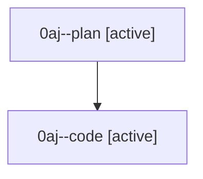

# Family: 0aj

[Agent Hoods](../README.md) / [bbugyi200](../users/bbugyi200/README.md) / [athena](../users/bbugyi200/machines/athena/README.md) / [0aj](../users/bbugyi200/machines/athena/hoods/0aj/README.md) / 0aj

Owner: `bbugyi200.athena` · Hood: `0aj` · Members: 2

## Lineage

The diagram is an optional enhancement; the ordered table below contains the same lineage in accessible text.

| Role | Agent | State | Model / provider | Timing | Commits | Prompt | Chat |
|---|---|---|---|---|---:|---|---|
| plan | 0aj--plan | active | gpt-5.6-sol / codex | 2026-08-22T11:26:44.228460+00:00 | 0 | [Prompt](../agents/bbugyi200.athena.0aj--plan/prompt.md) | [Chat](../agents/bbugyi200.athena.0aj--plan/chat.md) |
| code | 0aj--code | active | gpt-5.5 / codex | 2026-08-22T11:33:29.558301+00:00 | 0 | — | — |

## Commits

| Role | Repo | Commit | Subject | Committed |
|---|---|---|---|---|
| — | sase | [`d216bf9`](https://github.com/sase-org/sase/commit/d216bf9a0282d87fecaabc604df26ab216664f2d) | chore: Add SDD prompt and plan for dismiss\_unread\_agent\_dismisses\_notification | 2026-06-30 07:21:42 EDT |
| — | sase | [`86a4b6b`](https://github.com/sase-org/sase/commit/86a4b6b8c21c65af943293b10b431c8321b10a42) | fix: dismiss completion notifications with agent rows | 2026-06-30 07:33:44 EDT |

## Neighbors

| Agent | Relation | State |
|---|---|---|
| [0aj.f0](../agents/bbugyi200.athena.0aj.f0/README.md) | descendant | waiting |
