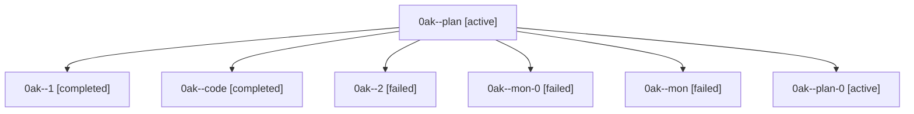

# Family: 0ak

[Agent Hoods](../README.md) / [bbugyi200](../users/bbugyi200/README.md) / [athena](../users/bbugyi200/machines/athena/README.md) / [0ak](../users/bbugyi200/machines/athena/hoods/0ak/README.md) / 0ak

Owner: `bbugyi200.athena` · Hood: `0ak` · Members: 7

## Lineage

The diagram is an optional enhancement; the ordered table below contains the same lineage in accessible text.

| Role | Agent | State | Model / provider | Timing | Commits | Prompt | Chat |
|---|---|---|---|---|---:|---|---|
| plan | 0ak--plan | active | gpt-5.6-sol / codex | 2026-08-22T11:38:28.179091+00:00 | 0 | [Prompt](../agents/bbugyi200.athena.0ak--plan/prompt.md) | [Chat](../agents/bbugyi200.athena.0ak--plan/chat.md) |
| 1 | 0ak--1 | completed | grok-4.6 / grok | 2026-08-22T12:55:49.338488+00:00 → 2026-08-22T13:01:30.426558+00:00 | 0 | [Prompt](../agents/bbugyi200.athena.0ak--1/prompt.md) | [Chat](../agents/bbugyi200.athena.0ak--1/chat.md) |
| code | 0ak--code | completed | grok-4.6 / grok | 2026-08-22T12:03:33.030099+00:00 → 2026-08-22T12:53:18.023936+00:00 | 0 | — | [Chat](../agents/bbugyi200.athena.0ak--code/chat.md) |
| 2 | 0ak--2 | failed | grok-4.6 / grok | 2026-08-22T13:26:59.540911+00:00 → 2026-08-22T13:36:55.218196+00:00 | 0 | [Prompt](../agents/bbugyi200.athena.0ak--2/prompt.md) | — |
| mon-0 | 0ak--mon-0 | failed | grok-4.6 / grok | 2026-08-22T13:00:50.765921+00:00 | 0 | — | [Chat](../agents/bbugyi200.athena.0ak--mon-0/chat.md) |
| mon | 0ak--mon | failed | grok-4.6 / grok | 2026-08-22T12:52:59.562419+00:00 | 0 | — | [Chat](../agents/bbugyi200.athena.0ak--mon/chat.md) |
| plan-0 | 0ak--plan-0 | active | gpt-5.6-sol / codex | 2026-08-22T11:48:10.913061+00:00 | 0 | — | [Chat](../agents/bbugyi200.athena.0ak--plan-0/chat.md) |

## Commits

| Role | Repo | Commit | Subject | Committed |
|---|---|---|---|---|
| — | sase | [`0edfb84`](https://github.com/sase-org/sase/commit/0edfb846b2bc80a4288e7a1a10d34686c935ddc6) | feat(ace)!: move Model Overrides to leader \`,m\` | 2026-06-30 07:46:15 EDT |
